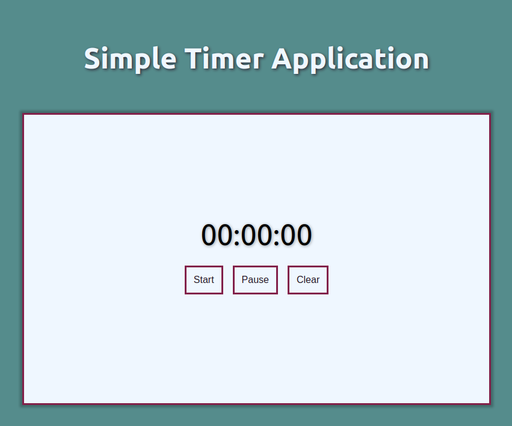
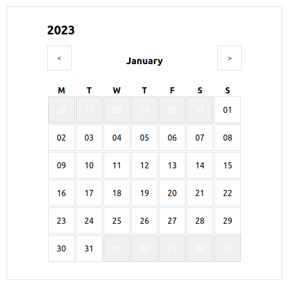
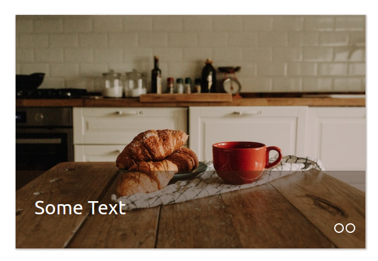

# Learning React Basics

## 01 Timer

Just a simple timer with start/pause/clear buttons. Nothing special :)

## 02 Calendar

A calendar. I don't really like Date in JS, so it's a good training for me...

## 03 Slider?

Kinda slider. It doesn't look amazing or even OK, because I've limited time for this element. 
Photo was taken from 
[Rhamely](https://unsplash.com/@rhamely?utm_source=unsplash&utm_medium=referral&utm_content=creditCopyText) 

## 04 What will it be?